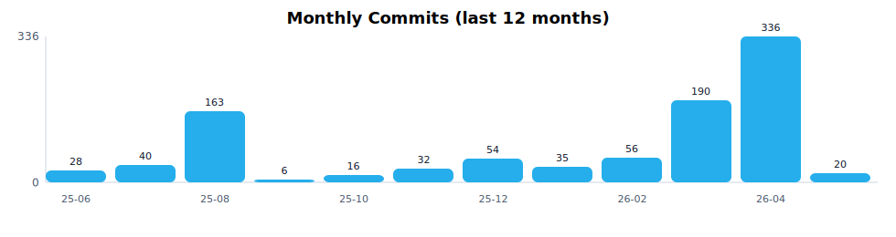
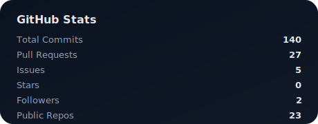
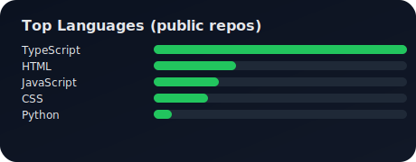

<!-- ====== Header ====== -->

  

<h1>👋 Kaito Ishitobi</h1>
## 🎮 Mini Games
- 🧠 Memory（神経衰弱） / 🧩 Slide Puzzle（スライドパズル）
- Play: https://kaiteen1003.github.io/kaiteen1003/

  <b>Full-Stack Web Engineer</b> building modern web apps, geospatial tools, and AI systems. 
  Next.js / TypeScript / Cloud / GIS Automation / Remote Sensing

  
  
  

 

<!-- ====== Activity ====== -->

<h2>📊 Monthly Commit Activity</h2>

 

<!-- ====== Quick Snapshot Cards ====== -->

  <table>
    <tr>
      <td align="center" width="50%">
        <h3>🧩 What I Do</h3>
        

          • Full-stack Web Apps (Next.js / TS) 
          • Cloud & DevOps (Docker / Nginx / AWS/GCP) 
          • GeoAI & Remote Sensing tooling 
          • QGIS automation & geospatial pipelines
        

      </td>
      <td align="center" width="50%">
        <h3>🎯 Currently</h3>
        

          • Learning: <b>Go</b>, <b>Terraform</b> 
          • Building: satellite imagery tooling, QGIS automation, Next.js apps 
          • Interest: scalable data systems + product engineering
        

      </td>
    </tr>
  </table>

 

<!-- ====== Tech Stack ====== -->

<h2>💻 Tech Stack</h2>

<h3>Frontend</h3>

  

<h3>Backend</h3>

  

<h3>Infra / DevOps</h3>

  

<h3>Geo / Tools</h3>

 

<!-- ====== Featured Projects ====== -->

<h2>🚀 Featured Projects</h2>
Pin your best repos on GitHub too (Profile → Customize pins)

<!-- ここは「カードUI風」に見せる -->
<table>
  <tr>
    <td width="50%">
      <h3>🌐 Web App / Product Engineering</h3>
      

        Next.js + TypeScript + Firebase/PostgreSQL で、 
        使われるプロダクトを素早く作り切るのが得意です。
      

      

        
      

    </td>
    <td width="50%">
      <h3>🛰 GeoAI / Remote Sensing</h3>
      

        Sentinel / Planet などの衛星画像を扱うパイプライン、 
        QGIS自動化・解析ツール・可視化に取り組んでいます。
      

      

        
      

    </td>
  </tr>
</table>

 

<!-- ====== Local Stats (no Error Fetching Resource) ====== -->

<h2>📈 GitHub Stats</h2>

 

<!-- ====== Summary Cards (optional; can error sometimes) ====== -->
<!-- ここは外部取得なので落ちるなら消してOK。残す場合は utcOffset→utc=9 を推奨 -->

<h2>📊 Contribution Summary</h2>

 

<!-- ====== Footer ====== -->

  Thanks for visiting — let's build something useful.

