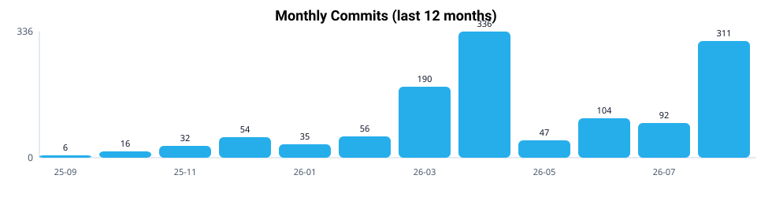

<!-- ====== Header ====== -->
<div align="right">
  
</div>

<div align="center">


<h1 align="center">
  
  Kaito Ishitobi
  
</h1>

<p>
  <b>フルスタック Web エンジニア</b>／短期間で「使われるプロダクト」を作り切ることが得意です。<br/>
  <sub>Next.js / TypeScript / Cloud / GIS 自動化 / リモートセンシング</sub>
</p>

<p>
  <a href="https://my-portforio-kaiteen1003s-projects.vercel.app/">
    
  </a>
  <a href="https://my-portforio-kaiteen1003s-projects.vercel.app/#contact">
    
  </a>
  <a href="https://github.com/kaiteen1003">
    
  </a>
  <a href="https://kaiteen1003.github.io/kaiteen1003/">
    
  </a>
</p>

</div>

<br/>

<!-- ====== Portfolio ====== -->
<div align="center">

<h2>🖥 ポートフォリオサイト</h2>

<p>
  これまでに作ったプロダクト・技術スタック・連絡先をまとめたサイトです。<br/>
  Next.js + TypeScript + Vercel で構築し、制作の背景や工夫した点まで掘って書いています。
</p>

<p>
  <a href="https://my-portforio-kaiteen1003s-projects.vercel.app/">
    
  </a>
  <a href="https://my-portforio-kaiteen1003s-projects.vercel.app/#contact">
    
  </a>
</p>

<table>
  <tr>
    <td align="center">🗂<br/><b>制作物</b><br/><sub>Web / GeoAI / 業務ツール</sub></td>
    <td align="center">🧭<br/><b>技術と設計</b><br/><sub>構成図・使用技術・工夫</sub></td>
    <td align="center">✉️<br/><b>連絡先</b><br/><sub>お問い合わせフォーム</sub></td>
  </tr>
</table>

</div>

<br/>

<!-- ====== Hackathons / Awards ====== -->
<div align="center">

<h2>🏆 ハッカソン・開発実績</h2>

</div>

**2025/08 ｜ クイック株式会社 チーム開発ハッカソン** &nbsp;
- フロントエンドを主担当。ER図をもとにバックエンドの一部実装も担当

**2025/08 ｜ GMOインターネットグループ チーム開発ハッカソン** &nbsp;
- 「ConoHa for GAME」向け ゲームサーバーコントロールパネルを開発

**2025/08 ｜ Safie アイデアソン** &nbsp;
- ペット向け見守り／監視システムの要求・要件定義をまとめて提出

**2025/07 ｜ Works Human Intelligence チーム開発ハッカソン** &nbsp;
- HR領域の Web サイトをチームで構築

**2025/06 ｜ サポーターズ主催ハッカソン** &nbsp;

**2024/04 ｜ 研究室DX（個人開発）** &nbsp;
- 自動ゴミ当番通知 bot と研究室 HP を個人で開発・運用

<br/>

<!-- ====== Work Experience ====== -->
<div align="center">

<h2>🧰 実務経験（長期アルバイト）</h2>

</div>

**建設・インフラ系テック企業｜大学2年 〜 修士2年（継続中）**

業務内容は概要のみ記載しています。

- 社内インフラの整備：開発用PCの組み立て、NAS の導入・運用、開発環境の構築
- 3D 解析ソフトへの機械学習機能の実装（Python）
- Excel VBA による統計処理・計算システムの構築
- 現場の点検・観察業務を支援する React アプリの構築
- 構造物データの可視化・分析アプリの構築
- 会社 Web サイトの制作

<br/>

<!-- ====== Projects ====== -->
<div align="center">

<h2>🛠 主な個人開発プロジェクト</h2>

</div>

<table width="100%">
  <tr>
    <td width="50%" valign="top">
      <h3>🧠 yoloMaster — YOLO 学習 GUI ツール</h3>
      <p>
        アノテーション済みデータの取り込み → 学習 → 精度検証までを GUI で完結させる研究室内ツール。<br/>
        物体検出／セグメンテーション／画像分類の3タスクに対応。ラベル検証、train/val 自動分割、
        別プロセス学習（ブラウザを閉じても継続）、混同行列・PR曲線での検証、ONNX / TensorRT 書き出しまで。
      </p>
      <p><sub>Python / Gradio / Ultralytics / PyTorch / SQLite</sub></p>
      <p>
        <a href="https://github.com/kaiteen1003/HashimaObsApp">
          
        </a>
      </p>
    </td>
    <td width="50%" valign="top">
      <h3>🛰 MarineDebrisDetection — 海洋ごみ検出 Web アプリ</h3>
      <p>
        画像から海洋ごみを検出する AI をブラウザから使えるようにしたアプリ。<br/>
        domain / ports / infrastructure / interfaceAdapters に分けたクリーンアーキテクチャ構成で、
        AI 実装を差し替え可能に。多言語対応つき。
      </p>
      <p><sub>Next.js / TypeScript / Clean Architecture / i18n</sub></p>
      <p>
        <a href="https://github.com/kaiteen1003/MarinDebrisDetection">
          
        </a>
      </p>
    </td>
  </tr>
  <tr>
    <td width="50%" valign="top">
      <h3>⏱ 5217 Timer — 3D ポモドーロタイマー</h3>
      <p>
        52分作業／17分休憩のリズムに合わせた集中タイマー。<br/>
        three.js の 3D モデルを組み込み、Radix UI で設定 UI を構築。最新の Next.js / React 構成で実装。
      </p>
      <p><sub>Next.js 16 / React 19 / three.js / Tailwind CSS / Radix UI</sub></p>
      <p>
        <a href="https://github.com/kaiteen1003/Pomodoro-Timer">
          
        </a>
      </p>
    </td>
    <td width="50%" valign="top">
      <h3>🪪 MyPortforio — ポートフォリオサイト本体</h3>
      <p>
        名刺から辿ってもらう前提で作った自己紹介サイト。<br/>
        プロフィール／スキル／制作物／お問い合わせの4セクション構成で、Framer Motion のアニメーションと
        shadcn/ui ベースのコンポーネントを組み合わせ、問い合わせは Formspree で受け取り。
      </p>
      <p><sub>Next.js 16 / React 19 / TypeScript / Tailwind CSS v4 / Framer Motion / Formspree</sub></p>
      <p>
        <a href="https://my-portforio-kaiteen1003s-projects.vercel.app/">
          
        </a>
        <a href="https://github.com/kaiteen1003/MyPortforio">
          
        </a>
      </p>
    </td>
  </tr>
  <tr>
    <td width="50%" valign="top">
      <h3>🤖 CommandBot / CleaningBot — 研究室の当番自動化</h3>
      <p>
        当番運用の「言った言わない」をなくすための小さな自動化2本。<br/>
        Slack のカスタムコマンドを受けて日英2言語のリマインダーを返す Flask サーバーと、
        Google カレンダー連携で清掃当番を自動通知する Apps Script。
      </p>
      <p><sub>Python / Flask / Slack API / Google Apps Script / Calendar API</sub></p>
      <p>
        <a href="https://github.com/kaiteen1003/CommandBot">
          
        </a>
        <a href="https://github.com/kaiteen1003/CleaningBot">
          
        </a>
      </p>
    </td>
    <td width="50%" valign="top">
      <h3>🌏 衛星画像の前処理パイプライン</h3>
      <p>
        Sentinel-2 の画像を高解像度化する学習用に、画像ペアを自動生成する前処理スクリプト群。<br/>
        研究で扱う衛星画像の下ごしらえを自動化。
      </p>
      <p><sub>Python / Remote Sensing / GIS</sub></p>
      <p>
        <a href="https://github.com/kaiteen1003/ImproveS2PictureQuality">
          
        </a>
        <a href="https://github.com/kaiteen1003?tab=repositories">
          
        </a>
      </p>
    </td>
  </tr>
</table>

<br/>

<!-- ====== Minigame ====== -->
<div align="center">

<h2>🎮 ブラウザで遊べるミニゲーム</h2>

<p>
  このプロフィール用に作った暇つぶし2本。神経衰弱とスライドパズル。<br/>
  素の HTML / CSS / JavaScript のみで実装し、GitHub Pages で公開しています。
</p>

<p>
  <a href="https://kaiteen1003.github.io/kaiteen1003/">
    
  </a>
  <a href="https://github.com/kaiteen1003/kaiteen1003/tree/main/public">
    
  </a>
</p>

<table>
  <tr>
    <td align="center" width="50%">
      <a href="https://kaiteen1003.github.io/kaiteen1003/#memory">
        🧠<br/><b>神経衰弱</b>
      </a><br/>
      <sub>4×4 / 6×6・テーマ2種<br/>3Dフリップとベスト記録つき</sub>
    </td>
    <td align="center" width="50%">
      <a href="https://kaiteen1003.github.io/kaiteen1003/#slide">
        🧩<br/><b>スライドパズル</b>
      </a><br/>
      <sub>3×3 / 4×4 / 5×5<br/>クリック・矢印キー操作対応</sub>
    </td>
  </tr>
</table>

<p><sub>HTML / CSS / Vanilla JavaScript / GitHub Pages</sub></p>

</div>

<br/>

<!-- ====== Tech Stack ====== -->
<div align="center">

<h2>💻 Tech Stack</h2>

<b>Frontend</b>


<b>Backend / Database</b>


<b>AI / データ・地理空間</b>


<b>インフラ / ツール</b>


</div>

<br/>

<!-- ====== Activity ====== -->
<div align="center">

<h2>📊 Monthly Commit Activity</h2>


</div>

<br/>

```
████████████████████████████████████████████████████████████  ██╗  ██╗███████╗██╗     ██╗      ██████╗
████████████████████████████████████████████████████████████  ██║  ██║██╔════╝██║     ██║     ██╔═══██╗
███████████████████████████████████`.        ╙██████████████  ███████║█████╗  ██║     ██║     ██║   ██║
████████████████████████████████▀  ¿▓▓▓▓▓▓▓▓▄/ "████████████  ██╔══██║██╔══╝  ██║     ██║     ██║   ██║
██████████████████████████████▀.  ▓▓▓▓▓▓▓▓▓▓▓▓   ▐██████████  ██║  ██║███████╗███████╗███████╗╚██████╔╝▄█╗
██████████████████████████████ `  ▓▓▓▓▓▓▓▓▓▓▓▓  ` ██████████  ╚═╝  ╚═╝╚══════╝╚══════╝╚══════╝ ╚═════╝ ╚═╝
██████████████████████████████ `  ▓▓▓▓▓▓▓▓▓▓▓▓   ▄██████████
▀██████████████████████████████▌  ▀▀▓▓▓▓▓▓▓▌╓╖. ████████████  ███╗   ██╗██╗ ██████╗███████╗  ████████╗ ██████╗
█▄▀██████████████████████████████▄ ╩╦╙▀▀▀▀▀ ╣`,█████████████  ████╗  ██║██║██╔════╝██╔════╝  ╚══██╔══╝██╔═══██╗
▄▀█▄╙█████████████████████▀▀▀▀█████▄▄ .... ,▄███████▀███████  ██╔██╗ ██║██║██║     █████╗       ██║   ██║   ██║
██▄▀█▄╙█████████████████▀  ╪╢%╦══~╓,└ ╚▒▒▒ ╙▀|,╓╓═╤H   ▀████  ██║╚██╗██║██║██║     ██╔══╝       ██║   ██║   ██║
█▀▀▀-▀█▌▄▀█████████████   ║▒▒▒▒▒▒▒▒▒▒╢╦ ╘ -╣▒▒▒▒▒▒▒▒▒╢╕   ▀█  ██║ ╚████║██║╚██████╗███████╗     ██║   ╚██████╔╝
██▄▀██└║▄▄▄████████████▄          ═╕╕╕╕╕═╕═══════       ▄▄▄▄  ╚═╝  ╚═══╝╚═╝ ╚═════╝╚══════╝     ╚═╝    ╚═════╝
████▄▀█▌║███  ████████▌         ╕   ╩▒▒▒▒▒▒▒▒▒Ñ          ███
██████▌Ö▓▌   ▀██████████`╔▒▒╣ █ ▒▒m   ╚▒╢▒▒▒╩ -╣▒ ▌ ▒▒▒ ████  ███╗   ███╗███████╗███████╗████████╗  ██╗   ██╗ ██████╗ ██╗   ██╗
████ -"" ∞╙,▀.╙▀███████╜ ▒▒▒ ▄█ Ñ   -   S.  ═▒▒▒▒ █ ║▒▒╕└███  ████╗ ████║██╔════╝██╔════╝╚══██╔══╝  ╚██╗ ██╔╝██╔═══██╗██║   ██║
████████▄ -«   ∞▄.▀",╓═     ╒██   ═╣▒▒ `Ñ╛        █▌ ▒▒▒ ███  ██╔████╔██║█████╗  █████╗     ██║      ╚████╔╝ ██║   ██║██║   ██║
█████████▌ º     ╤╣▒╣╩^",▄▄███▀  ▒▒╣"     ''''''' ▀▀     `██  ██║╚██╔╝██║██╔══╝  ██╔══╝     ██║       ╚██╔╝  ██║   ██║██║   ██║
█████████  ▌       ▄▄████████─         ---------    L'▒▒▒ ██  ██║ ╚═╝ ██║███████╗███████╗   ██║        ██║   ╚██████╔╝╚██████╔╝
▀▀▀▀▀▀▀▀▀▀▀▀▀-     ▀▀▀▀▀▀▀▀▀▀       '╧╧╧╧╧╧╧╧╧`     ╚ ╧╧╧- ▀  ╚═╝     ╚═╝╚══════╝╚══════╝   ╚═╝        ╚═╝    ╚═════╝  ╚═════╝
```
<!-- ====== Footer ====== -->
<div align="center">
  <br/>
  <b>You made it to the end!</b>
</div>

<div align="center">
<br><a href="https://github.com/Anmol-Baranwal/GIFs-For-Readme"></a> 
</div>
